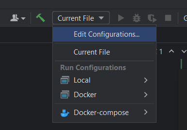
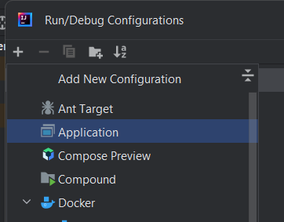
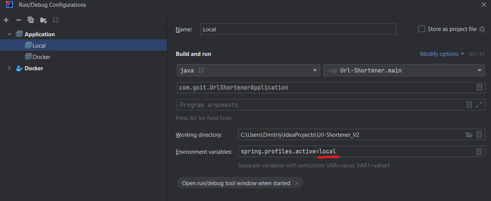
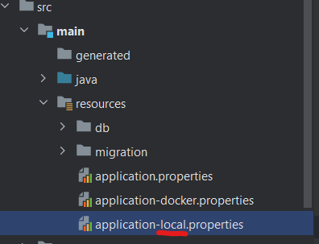

Нужно зайти в папку с проектом и открыть из нее командную строку.
Из нее выполнить команду:  
`docker build -t goit-proj .`

после того как проект сбилдится надо выполнить команду:  
`docker-compose up -d`

чтобы создать разные профили надо в верхнем меню выбрать подпункт edit configurations

затем выбрать add new configuration и выбрать пункт application

при создании профиля имя переменной окружения должно совпадать с именем переменной свойств которая будет использоватся с этим профилем 

